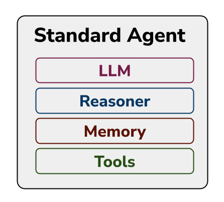

# Standard Agent 🛠️ — Composable Agents

[](https://discord.gg/yrxmDZWMqB)
[](https://github.com/jentic/standard-agent/blob/HEAD/CODE_OF_CONDUCT.md)
[](https://github.com/jentic/standard-agent/blob/HEAD/LICENSE)
[](https://hacktoberfest.com/)
[](https://github.com/jentic/standard-agent/issues?q=is%3Aissue+is%3Aopen+label%3A%22good+first+issue%22)

> **🎃 Hacktoberfest 2025 Participant!** We're excited to welcome new contributors during Hacktoberfest. Check out our [good first issues](https://github.com/jentic/standard-agent/issues?q=is%3Aissue+is%3Aopen+label%3A%22good+first+issue%22) and [contribution guide](./good_first_issue.md) to get started!

- [Quick Start](#quick-start)
- [Contributing](#contributing)
- [Usage Examples](#usage-examples)
- [Project Layout](#project-layout)
- [Core Runtime Objects](#core-runtime-objects)
- [Extending the Library](#extending-the-library)
- [Community](#community)
- [Roadmap](#roadmap)

## Architecture Overview

*Standard Agent* is a simple, modular library for building AI agents, with a composable core and plug‑in components. 

It is *not* a complete agent with a nice user interface. It is a library that provides the core agent reasoning loop that bridges an LLM with tools, featuring a flexible design that allows you to swap out different LLMs, reasoning strategies, memory backends, and tool providers. A basic example CLI interface is provided, but you will generally have to provide your own system prompt, tool set and UI. [Jentic](https://jentic.com) can help with the tool set, but you can also roll your own.



It is deliberately small so it can be easily read and understood (whether by you or your coding agent), and used with confidence. This is a *less is more* approach to agent development. You can browse it to understand how agents work. You can use it to quickly build your own agents, skipping the boilerplate and focusing on business logic. 

*Standard Agent* excels when equipped with just-in-time tool loading, a paradigm that we advocate at [Jentic](https://jentic.com). This means dynamically loading (or "late-binding") tools at run-time depending on the specific goal or task at hand. This permits better context engineering, keeping the context uncluttered and the LLM focused on the tool details that matter, while eliminating practical limits on the number of tools that can be provided (here's a [blog post](https://jentic.com/blog/just-in-time-tooling) on the topic).

### Why Standard Agent?

- **🔧 Composable**: Swap LLMs, reasoners, tools, and memory backends without rewriting code
- **📚 Educational**: Small, readable codebase perfect for learning how agents work
- **🚀 Production-Ready**: Used in real applications with proper error handling and logging
- **🧩 Extensible**: Clean interfaces make it easy to add new reasoning strategies and tools
- **🤝 Community-Driven**: Open source with active Discord community and Hacktoberfest participation

## Contributing

We welcome contributions of all kinds! Whether you're fixing typos, adding features, or improving documentation, your help makes Standard Agent better for everyone.

### 🌟 New Contributors Welcome!

- **Never contributed to open source?** No problem! Check our [good first issues](https://github.com/jentic/standard-agent/issues?q=is%3Aissue+is%3Aopen+label%3A%22good+first+issue%22)
- **Looking for bigger challenges?** Browse our [enhancement issues](https://github.com/jentic/standard-agent/issues?q=is%3Aissue+is%3Aopen+label%3Aenhancement)
- **Want to add examples?** We'd love more [platform integrations and use cases](https://github.com/jentic/standard-agent/issues?q=is%3Aissue+is%3Aopen+label%3Aexamples)

### Quick Contribution Setup

```bash
# Fork the repo on GitHub, then:
git clone https://github.com/YOUR_USERNAME/standard-agent.git
cd standard-agent
make install
source .venv/bin/activate
make test  # Ensure everything works
```

Read our [Contributing Guide](./CONTRIBUTING.md) and [Good First Issues Guide](./good_first_issue.md) for detailed instructions.

### 🎃 Hacktoberfest 2024

We're participating in Hacktoberfest! Here's how to get involved:

1. **Find an issue**: Look for issues labeled `hacktoberfest` and `good first issue`
2. **Read the guides**: Check [good_first_issue.md](./good_first_issue.md) for detailed instructions
3. **Join the community**: Get help in our [Discord](https://discord.gg/yrxmDZWMqB)
4. **Make your PR**: Follow our [PR template](.github/pull_request_template.md)

**Popular contribution areas:**
- 📝 **Documentation**: Improve examples, fix typos, add tutorials
- 🧪 **Testing**: Add test coverage, create integration tests  
- 🎯 **Examples**: Build Discord/Slack bots, calculator agents, file processors
- 🔧 **Code Quality**: Add type hints, improve error handling, optimize performance
- 🚀 **Features**: New reasoner strategies, tool integrations, memory backends

## Quick Start

### Installation

```bash
# Install from PyPI (recommended)
pip install standard-agent

# Or install from source
git clone https://github.com/jentic/standard-agent.git
cd standard-agent
make install
source .venv/bin/activate
```

### Configuration

Before running the agent, you need to create a `.env` file in the root of the project to store your API keys and other secrets. The application will automatically load these variables.

#### Quick Setup:
1. Copy the provided template: `cp .env.example .env`
2. Edit the `.env` file and replace placeholder values with your actual API keys
3. At minimum, you need one LLM provider key to get started
4. Add `JENTIC_AGENT_API_KEY` for out-of-the-box tool access (recommended)

See [.env.example](./.env.example) for the complete configuration template with detailed comments and setup instructions.

#### Key Requirements:
- **LLM Model**: `LLM_MODEL` - Choose your preferred model
- **LLM Provider**: At least one API key (Anthropic, OpenAI, or Google)
- **Tool Provider**: `JENTIC_AGENT_API_KEY` for turn-key access to capabilities based on 1500+ APIs (get yours at [jentic.com](https://jentic.com))

### Usage Examples

*Standard Agent* includes pre-built agent classes for a quick-start, but you can also compose your own agent from scratch. Both approaches are shown below.

#### 1. Quick Start: Running a Pre-built Agent

This is the fastest way to get started. `ReWOOAgent` and `ReACTAgent` are subclasses of `StandardAgent` that are pre-configured with a reasoner, LLM, tools, and memory.

```python
# examples/cli_api_agent.py
import os
from dotenv import load_dotenv
from agents.prebuilt import ReWOOAgent, ReACTAgent
from examples._cli_helpers import read_user_goal, print_result

# Load API keys from .env file
load_dotenv()

# 1. Get the pre-built agent.
# Choose a prebuilt profile (ReWOO or ReACT)
agent = ReWOOAgent(model=os.getenv("LLM_MODEL"))
# agent = ReACTAgent(model=os.getenv("LLM_MODEL"))

# 2. Run the agent's main loop.
print("🤖 Agent is ready. Press Ctrl+C to exit.")
while True:
    goal_text = None
    try:
        goal = read_user_goal()
        if not goal:
            continue
        
        result = agent.solve(goal)
        print_result(result)

    except KeyboardInterrupt:
        print("\n🤖 Bye!")
        break
```

#### 2. Custom: Compose Your Own Agent

The real power of *Standard Agent* comes from its **composable architecture**. Every component is swappable, allowing you to create custom agents tailored to your specific needs, without reimplementing a lot of code. Here's how to build agents from scratch by mixing and matching components.

```python
# main_build_your_own_agent.py
import os
from dotenv import load_dotenv

# Import the core agent class
from agents.standard_agent import StandardAgent

# Import different implementations for each layer
from agents.llm.litellm import LiteLLM
from agents.tools.jentic import JenticClient
from agents.memory.dict_memory import DictMemory

# Import reasoner components
from agents.reasoner.rewoo import ReWOOReasoner

from examples._cli_helpers import read_user_goal, print_result

load_dotenv()

# Step 1: Choose and configure your components
llm = LiteLLM(model="gpt-4")
tools = JenticClient()
memory = DictMemory()

# Step 2: Pick a reasoner profile (single-file implementation)
custom_reasoner = ReWOOReasoner(llm=llm, tools=tools, memory=memory)

# Step 3: Wire everything together in the StandardAgent
agent = StandardAgent(
    llm=llm,
    tools=tools,
    memory=memory,
    reasoner=custom_reasoner
)

# Step 4: Use your custom agent
print("🤖 Custom Agent is ready!")
while True:
    goal_text = None
    try:
        goal = read_user_goal()
        if not goal:
            continue
            
        result = agent.solve(goal)
        print_result(result)
        
    except KeyboardInterrupt:
        print("\n🤖 Bye!")
        break
```

## Architecture

*Standard Agent* provides a composable architecture that allows you to swap out different LLMs, reasoning strategies, memory backends, and tool providers. This allows you to:

- **Start simple** with pre-built agents like `ReWOOAgent`
- **Gradually customize** by swapping individual components
- **Experiment easily** with different LLMs, reasoning strategies, or tool providers
- **Extend incrementally** by implementing new components that follow the same interfaces
- **Mix and match** components from different sources without breaking existing code

Each component follows well-defined interfaces (`BaseLLM`, `BaseMemory`, `JustInTimeToolingBase`, etc.), so they can be combined in any configuration that makes sense for you.

### Project Layout

```
.
├── agents/
│   ├── standard_agent.py           # The main agent class orchestrating all components
│   ├── prebuilt.py                 # Factory functions for pre-configured agents (e.g., ReWOO)
│   ├── llm/                        # LLM wrappers (e.g., LiteLLM)
│   ├── memory/                     # Memory backends (e.g., in-memory dictionary)
│   ├── tools/                      # Tool integrations (e.g., Jentic client)
│   └── reasoner/                   # Core reasoning and execution logic
│       ├── base.py                 # Base classes and interfaces for reasoners
│       ├── rewoo.py                # ReWOO (Plan → Execute → Reflect)
│       └── react.py                # ReACT (Think → Act)
│   ├── goal_preprocessor/          # [OPTIONAL] Goal preprocessor
│
├── utils/
│   └── logger.py                   # Logging configuration
│
├── examples/                       # Runnable scripts and helper snippets
│
├── tests/                          # Unit and integration tests
├── Makefile                        # Commands for installation, testing, etc.
├── pyproject.toml                  # Project and dependency metadata
└── config.json                     # Agent configuration file
```

### Core Runtime Objects

| Layer            | Class / Protocol                                                     | Notes                                                             |
|------------------|----------------------------------------------------------------------|-------------------------------------------------------------------|
| **Agent**        | `StandardAgent`                                                      | Owns Reasoner, LLM, Memory, and Tools                             |
| **Reasoners**    | `ReWOOReasoner`, `ReACTReasoner`                                      | Each orchestrates a different reasoning strategy (profile).       |
| **Memory**       | `MutableMapping`                                                         | A key-value store accessible to all components.                   |
| **Tools**        | `JustInTimeToolingBase`                                              | Abstracts external actions (APIs, shell commands, etc.).          |
| **LLM Wrapper**  | `BaseLLM`                                                            | Provides a uniform interface for interacting with different LLMs. |
| **Goal Preprocessor** | `BaseGoalPreprocessor`                                            | [Optional] Preprocess goals before reasoning                      |

### Reasoner Strategies

The library currently ships two reasoner strategies:

- **ReWOOReasoner** (`agents/reasoner/rewoo.py`): Plan → Execute → Reflect  (arxiv [link](https://arxiv.org/abs/2305.18323))
- **ReACTReasoner** (`agents/reasoner/react.py`): Think → Act (arxiv [link](https://arxiv.org/abs/2210.03629))

Each profile exposes a `run(goal: str) -> ReasoningResult` and produces a `transcript`. The agent synthesizes the final answer from the transcript.

We note that there are broadly two ways to implement agentic reasoning:

- "Explicit" reasoning explicitly implements the reasoning strategy in the code that calls the LLM. ReWOO is more explicit.
- "Implicit" reasoning lets the LLM steer the reasoning strategy, informed only by the system prompt. ReACT is more implicit.

We welcome contributions of new reasoning strategies anywhere on this spectrum. If you add a profile, please keep it as a single module that implements the `BaseReasoner` class and define its prompts in YAML under `agents/prompts/reasoners/`.

### Extending the Library

The library is designed to be modular. Here are some common extension points:

| Need                               | How to Implement                                                                                                                                                                     |
|------------------------------------|--------------------------------------------------------------------------------------------------------------------------------------------------------------------------------------|
| **Different reasoning strategy**   | Create a new `BaseReasoner` implementation (e.g., `TreeSearchReasoner`) and inject it into `StandardAgent`.                                                                          |
| **New tool provider**              | Create a class that inherits from `JustInTimeToolingBase`, implement its methods, and pass it to your `StandardAgent`.                                                               |
| **Persistent memory**              | Create a class that implements the `MutableMapping` interface (e.g., using Redis), and pass it to your `StandardAgent`.                                                              |
| **New Planners, Executors, etc.**  | Create your own implementations of `Plan`, `ExecuteStep`, `Reflect`, or `SummarizeResult` to invent new reasoning capabilities, then compose them in a `SequentialReasoner`. |
| **Pre-process or validate goals**  | Create a class that inherits from `BaseGoalPreprocessor` and pass it to `StandardAgent`. Use this to resolve conversational ambiguities, check for malicious intent, or sanitize inputs. |

## Community

### 💬 Get Help & Connect

- **[Discord Community](https://discord.gg/yrxmDZWMqB)**: Real-time chat, questions, and collaboration
- **[GitHub Discussions](https://github.com/jentic/standard-agent/discussions)**: Longer-form discussions and Q&A
- **[GitHub Issues](https://github.com/jentic/standard-agent/issues)**: Bug reports and feature requests

### 🤝 Ways to Contribute

We believe everyone can contribute, regardless of experience level:

| Your Background | How You Can Help |
|-----------------|------------------|
| **New to OSS** | Fix typos, improve documentation, add examples |
| **Python Developer** | Add tests, improve code quality, fix bugs |
| **AI/ML Expert** | Implement new reasoner strategies, optimize performance |
| **Platform Expert** | Create Discord/Slack/Teams bot examples |
| **DevOps/Tools** | Improve CI/CD, add automation, enhance tooling |

### 🏆 Recognition

All contributors are recognized in our [contributor documentation](./CONTRIBUTORS.md) and through GitHub's contributor features. We celebrate contributions of all sizes!

## Roadmap

We welcome all help implementing parts of the roadmap, or contributing new ideas. We will merge anything we think makes sense in this core library, and will link to all other relevant work.

### 🎯 Near-term Goals
- Additional pre-built reasoner implementations (Tree-of-Thoughts, Graph-of-Thought)
- More out-of-the-box composable parts to enable custom agents  
- Enhanced examples and tutorials
- Improved testing and documentation coverage

### 🚀 Medium-term Vision
- Web dashboard (live agent state + logs)
- Vector-store memory with RAG planning
- Redis / VectorDB memory backends
- More advanced CLI examples with local file system tools
- Async agent loop & concurrency-safe inboxes

### 💡 How to Contribute Ideas
Ideas are welcome! [Open an issue](https://github.com/jentic/standard-agent/issues) or [submit a pull request](https://github.com/jentic/standard-agent/pulls). For major changes, consider discussing in our [Discord](https://discord.gg/TdbWXZsUSm) first.

---

## License

Licensed under the Apache License, Version 2.0. See [LICENSE](./LICENSE) for details.

## Citation

If you use Standard Agent in your research, please cite:

```bibtex
@software{standard_agent_2024,
  title={Standard Agent: A Composable Framework for Building AI Agents},
  author={Jentic Team},
  year={2024},
  url={https://github.com/jentic/standard-agent}
}
```