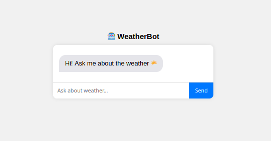
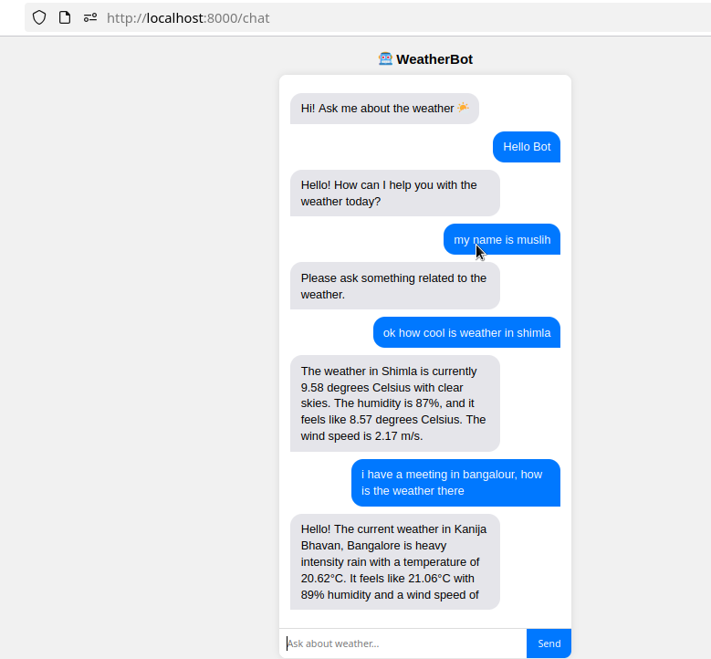

# Weather Bot

An intelligent weather assistant powered by AI that provides real-time weather information through both CLI and web interfaces.
        
## Features

- 🤖 AI-powered conversational weather queries
- 🌍 Real-time weather data from OpenWeather API
- 💬 Dual interface: Command-line and Web UI
- 🔧 Support for multiple LLM providers (Gemini, OpenAI)
- ⚡ Fast and responsive


## Installation

### 1. Clone the Repository

```bash
git clone https://github.com/jentic/standard-agent.git
cd standard_agent
```

### 2. Install Dependencies

```bash
make install
```

### 3. Activate Virtual Environment

```bash
source .venv/bin/activate
```

### 4. Navigate to Weather Bot

```bash
cd examples/weather_bot
```

### 5. Install Weather Bot Requirements

```bash
pip3 install -r requirements.txt
```

## Configuration

### 1. Create Environment File

Create a `.env` file in the `examples/weather_bot` directory:

```bash
touch .env
```

### 2. Add API Keys

Add the following environment variables to your `.env` file:

```env
OPENWEATHER_API_KEY=your_openweather_api_key_here
GEMINI_API_KEY=your_gemini_api_key_here
OPENAI_API_KEY=your_openai_api_key_here
LLM_MODEL=gemini/gemini-2.0-flash
```

### 3. Get API Keys

- **OpenWeather API Key**: [https://home.openweathermap.org/api_keys](https://home.openweathermap.org/api_keys)
- **Gemini API Key**: [https://aistudio.google.com/api-keys](https://aistudio.google.com/api-keys)
- **OpenAI API Key** (optional): [https://platform.openai.com/api-keys](https://platform.openai.com/api-keys)

## Usage

### Command Line Interface (CLI)

Run the weather bot in your terminal:

```bash
        python -m app.cli_bot
```

You can then interact with the bot by typing natural language queries like:
- "What's the weather in London?"
- "Will it rain in Tokyo tomorrow?"

### Web Interface

Start the web server:

```bash
        fastapi run app/bot.py 
```

The web interface will be available at:
- **Local**: http://localhost:8000/chat
- **API Docs**: http://localhost:8000/docs

Open your browser and navigate to the local URL to interact with the weather bot through a user-friendly web interface.

## Supported LLM Models

You can configure different LLM models by changing the `LLM_MODEL` variable in your `.env` file:

- `gemini/gemini-2.0-flash`
- `gemini/gemini-1.5-pro`
- `openai/gpt-4`
- `openai/gpt-3.5-turbo`

## Project Structure

```
examples/weather_bot/
├── app/
│   ├── agent.py          # CLI agent implementation
│   └── ...
├── requirements.txt       # Python dependencies
├── .env                  # Environment variables (create this)
└── README.md            # This file
```


